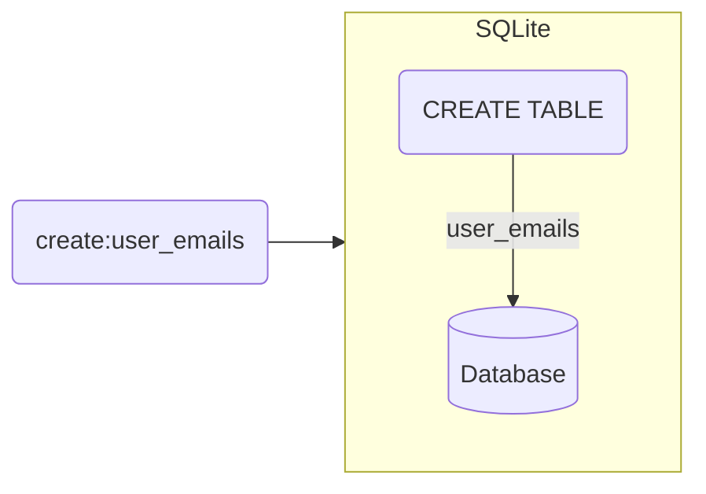

TLDR; a key-value store built on top of [SQLite](https://www.sqlite.org/index.html) using the [Rust](https://www.rust-lang.org/) programming language.

## Table creation

Collections of data will be stored in tables, this allows your data to be categorised as needed.



All tables will follow the `(k,v)` pattern.

- `k` - `varchar(255) PRIMARY KEY UNIQUE NOT NULL`
- `v` - no constraint added

This adds some restriction to they key while the value can be a range of values. Meaning that all three of the below records are considered valid.

```sql
INSERT INTO user_emails(k,v) VALUES('bobby', 'abc@abc.com'),('jimmy', 123),(sally, NULL);
```

### Creation API

```rust
let database = Sqlite::connect();
let result: Result<(), Err> = database.create_table("user_emails");

match result {
  Ok(_) => println!("New table created"),
  Err(e) => println!("Something went wrong: {:?}", e)
}
```

### Creation Query

```sql
CREATE TABLE IF NOT EXISTS user_emails(
  k varchar(255) PRIMARY KEY UNIQUE NOT NULL,
  v
);
```

## Table query

> TODO